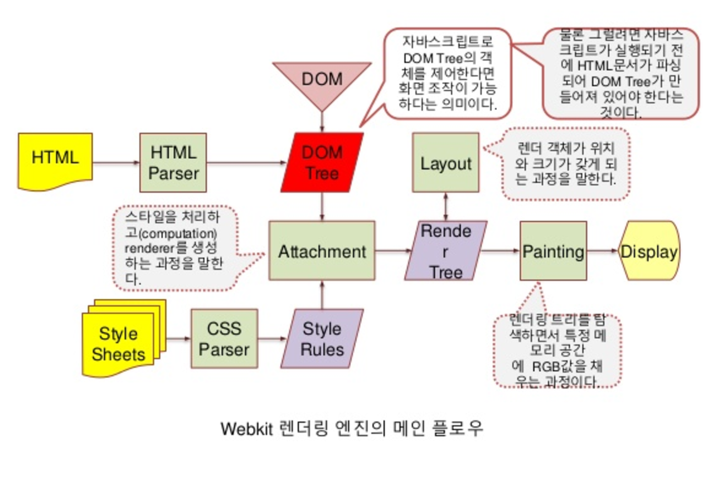

# 브라우저 렌더링 
브라우저의 주요 기능은 HTML, PDF, 이미지 같은 요소를 화면상에 표현해주는 기능을합니다.    
IE, 파이어폭스, 크롬, 사파리등 브라우저들은 각각 HTML을 해석하고 화면에 나타내는방법은 브라우저 스펙에따라 조금씩 다를 수 있습니다.  
그래도 공통적인 요소들을 가지고 있으니 각각 역할에 대해서 알아보겠습니다. 

## 요소 
각 요소가 어떤 역할을 하는지 알아보겠습니다.
#### UI 
주소창, 즐겨찾기버튼, 크롬익스텐션 등등 UI적 요소들

#### 렌더링 엔진 
HTML과 CSS를 파싱하고 화면에 파싱된 컨텐츠를 표현해주는 역할을 합니다.

#### 브라우저 엔진 
렌더링엔진에 작업을 다룹니다.  

#### 네트워킹
HTTP Request 같은 네트워크 호출을 다룹니다.

#### 자바스크립트 해석기
자바스크립트 코드를 파싱하고 실행하는 역할을 합니다.

#### 데이터 스토리지 
쿠키같은 로컬영역에 데이터를 저장시킬 공간 (크롬은 RDB sqlite, HTML5 표준 IndexdDB를 사용)

## 웹엔진
웹 엔진의 주요 역할을 웹서버에 저장된 HTML 문서를 다운받아 윈도우 영역에 표시 해주는 역할을 합니다.   

간단히 요약해서 보면    

불러오기 -> 파싱 (DOM Tree 생성) -> 자바스크립트 실행 -> 레이아웃 작업 -> CSS 처리 -> 페이지에 그리기 순으로 이루어집니다. 하나하나 살펴볼게요  

#### 1.불러오기
로더(Loader)라는 친구가 Http나 파일읽기 등으로 전달받은 리소스 스트림을 읽는 과정입니다. 읽으면서 이미 읽은 데이터인지 파일은 다운받을지 말지를 결정해줍니다.     
 
#### 2.파싱
웹 엔진은 HTML/XML 파서를 가지고있습니다. DOM Tree에 대해서 자바스크립트 DOM시간에 배웠었죠? 이떄 DOM Tree가 만들어집니다. 
 
#### 3.렌더링 트리 
DOM Tree가 만들어졌지만 사실 화면에 표시하기위해서는 다른 형태의 데이터 구조가 필요합니다.   
즉, DOM Tree는 내용을 저장하는 트리이고 화면을 그리기위해 별도의 트리가 만들어지는데 그것이 렌더링 트리입니다.

Display : None와 head title body 태그등 화면에 표시될 필요가없는 태그들을 렌더링 트리에 추가되지 않습니다.

#### 4.CSS 결정 
CSS는 셀렉터에 따라서 적용되는 태그가 다르기때문에 모든 CSS 스타일을 분석하여 태그에 스타일 규칙이 적용되는지 결정한다.

#### 5.레이아웃 
렌더링 트리가 생성될때 랜더객체는 위치나 크기를 가지고 있지 않습니다. 객체들에게 위치와 크기를 정해주는 과정을 레이아웃이라고 합니다.

#### 6.그리기 
렌더링 트리를 탐새갛면서 특정 메모리 공간에 RGB값을 채우는 과정입니다.

## 렌더링 엔진
렌더링 엔진에 대해서 한번더 살펴볼게요 말그대로 렌더링을 해주는 엔진입니다. 브라우저별로 렌더링 엔진의 종류가 다릅니다.

- IE : Trident
- 크롬 : Webkit
- 파이어폭스 : Gecko
- 사파리 : Webkit
- 오페라 : Presto

#### 렌더링 엔진의 기본흐름
HTML문서를 파싱 (DOM Tree 생성) -> HTML의 스타일 정보들은 별도의 렌더트리로 구성 -> 렌더트리의 레이아웃 과정 수행 -> 트리를 순회하며 노드들을 화면에 표시해줍니다.
 

 
 